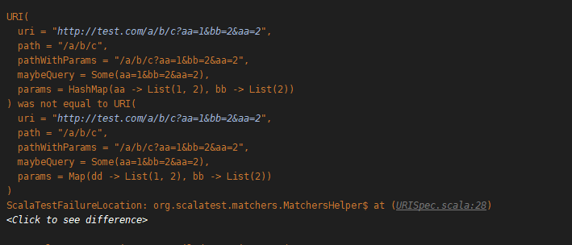
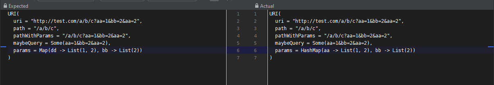

# Scala Case Class Prettification

[scala-case-class-prettification](https://github.com/pbyrne84/scala-case-class-prettification)

In scalatest there is a fairly hidden way to change the rendering off diffs on failure.

e.g. a test failure on the command line looks like this



And when "clicking to see the difference" the difference is made clearer in intellij



```scala
import org.scalactic.Prettifier

object Prettifiers {
  implicit val prettifier: Prettifier = Prettifier.apply {
    case a: AnyRef if CaseClassPrettifier.shouldBeUsedInTestMatching(a) =>
      new CaseClassPrettifier().prettify(a)

    case a: Any => Prettifier.default(a)
  }
}
```

You may have to do a clean compile to get the implicit to compile in. If you have a look at the tests you can
see it is very similar how zio renders errors

[CaseClassPrettifierTest.scala](https://github.com/pbyrne84/scala-case-class-prettification/blob/master/modules/scala-case-class-prettification/src/test/scala/com/bintray/scala/prettification/CaseClassPrettifierTest.scala)

e.g.
```
NestedMultiLevel(
  fieldName1 = 4,
  fieldName2 = NestedBasic(
    fieldName1 = 4,
    fieldName2 = SinglePrimitive(
      fieldName1 = 4
    )
  )
)
```

With intellij or something similar when it fails the diff is easily comparable. It doesn't try and do anything fancy such as maximum line
length as that would potentially break the ease of compare.

I do put this in any project using scalatest as games of spot the difference on failure are needlessly tiring. Especially when
dealing with theSameElementsAs on collections of case classes. There can have too many things wrong in the match and then the simplest thing
is to sort then do the diff. There is probably a way to write a matcher that auto sorts on the way in to fix the hoopla that matcher causes.
**theSameElementsAs** and things like it are a bit of a bug bear as the user is usually thinking of the success and not the potentially
anti-social failure.