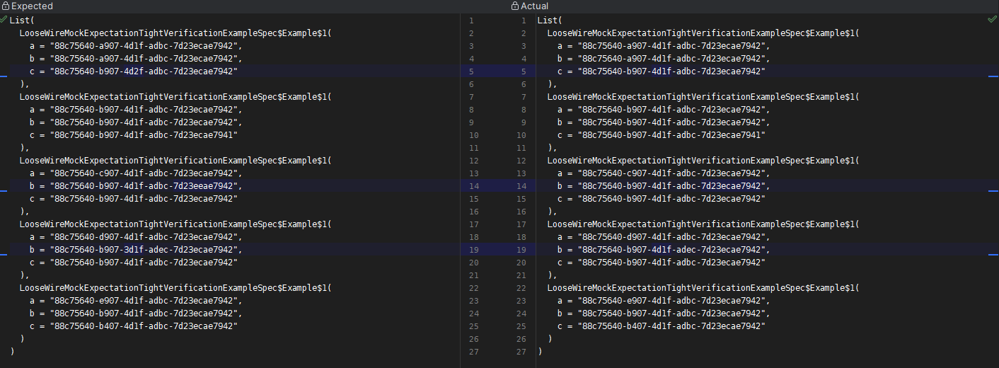

# Friendly Automated Testing For Engineers

The examples in this document will be scala test. The principles will be the same for any testing framework.

Tests are there to help us relieve mental pressure, not add to it.

## My rules for what tests are for (most important first)

Once we can no longer reason about a system, then we can no longer estimate within the system.

### Allow simulation of a production problem easily
You think there is a problem along boundary y, being able to prove or disprove your belief easily is a game changer. This
should feel like a calm experience. If something gives you a headache, then possibly the approach is wrong.

### Communication for what you have reasoned about and also deemed non-important
When building systems, correctness is not a boolean. Tests are there for you to communicate what is correct enough and
why. This is why in the tests the messages should always be why you expect things. If something is going to appear 
anomalous, such as it being weird business rules, then the reasons for the weirdness can be communicated in the test.

Whatever level of experience I have, you should not blindly trust me, and I should not blindly trust you. We all have bad days,
 tests allow us to have bad days.

### Allow system observation in a repeatable fashion
"Trust but verify" - though as an engineer, I would remove the trust part, I don't trust myself :)

Manually hitting through a system from the top to try and understand it is error-prone and also tiring. I start thinking
of automation quite early as I lose attention on repetitious tasks. A well-designed test hierarchy allows easy experimentation
within a system to work out what happens when X happens. This means there needs to be tests that do go through the whole system.

Some people would take that to the extreme and just have end-to-end tests, but those tests end up having a high cost to own and 
maintain as they are non-communicative and meandering. It ties into correctness, I pass the thingy in, and the thingy ends up
in the database is no-where near communicative enough (what are the rules for all the boundaries and error cases?).

Tests are a cost, they are there to help with our velocity. We need to keep track of how they holistically create a negative 
experience, for example, mocking all the lower dependencies, so everyone now has to manually debug the app when they inherit
it to actually work out what is really happening. That adds up to a real time sink, and if there are any things that are not
locked down by signatures like thrown exceptions which are recovered later, good luck proving that works. Though I would say
in Scala just use tightened errors with **Either**, it is in the signature and errors are what make our live unhappy.

An Exception is just a minor ratio of an outcome. Nothing special. If it involves networking, it will go wrong at some point,
in production where you cannot see what it is doing so add that logging so you can reproduce locally.

### Failure should be clear
We only really notice tests when we have to need to change them or when they fail. Tests can be fragile <https://www.everydayunittesting.com/2022/05/the-truth-about-fragile-tests.html>, our hubris can infect tests like it can infect our code. It is 
nice when we have a clear failure, we can focus on the issue causing the failure.

Code should not have to change/debuggers be used to work out what failed. It wastes a lot of time and causes a **LOT** of stress.
Possibly enough unneeded stress that people leave the industry. Sucks the fun out as it shows a lack of care. Though this
is a care that has to be learnt like a lot of socialized behaviour.

If tests are written before code, it can help surface that the messaging is not clear as failure is much more likely to 
be experienced.


### Prove what you deem to be correct enough in a clear fashion
So this is where I would like to break the dopamine hit of testing. Too many tests are written with the sole concept of
proving self-correctness after the code has been written. The issue with tests last is it leaves test suites in a state 
that everyone ends up needing to do test last due to they are incoherent.

Correctness is limited by time, experience and ability. Badly written tests start eating time which inhibits the time 
that can be spent on keeping the code base clean.


## Friendly failing assertions
Tests are there to help us when things fail, so failures being clear helps this. Always getting nice "expected but got actual"
messages just makes things less exciting in a good way. 

### Not using things in assertions that hide the failure

#### Testing option

##### Just using a matcher

```scala
"option" should {
  "fail in a nice fashion" in {
    None shouldBe Some(1)
  }
}
```

fails with 

```
Expected :Some(1)
Actual   :None
```

##### Using OptionValues trait

```scala
"option" should {
  "fail in a not nice fashion1" in {
    val maybeInt: Option[Int] = None

    maybeInt.value shouldBe Some(1)
  }
}
```

fails with 

```
ScalaTestFailureLocation: uk.org.devthings.scala.wiremockapi.remapping.LooseWireMockExpectationTightVerificationExampleSpec at (LooseWireMockExpectationTightVerificationExampleSpec.scala:101)
org.scalatest.exceptions.TestFailedException: The Option on which value was invoked was not defined.
```

That gives me a twinge of a headache.

##### Calling .get on the option

```scala
"option" should {
  "fail in a not nice fashion2" in {
    val maybeInt: Option[Int] = None

    // There should be no .get in scala code or any calls that raise exceptions. There are usually things that return
    // a monad etc.
    maybeInt.get shouldBe Some(1) 
  }
}
```

fails with 

```
None.get
java.util.NoSuchElementException: None.get
```

Not nice and that is a hard fail


#### Testing Either

Either is similar to option, but has the bonus that either side can have important information so hard failing on a left
versus an expected right means you need to see what was received.

##### Testing Either success nicely

```scala
"either" should {
  "fail in a nice fashion when receiving a left when expecting a right" in {
    val errorOrResult: Either[Throwable, Boolean] = Left(new RuntimeException("Banana cake"))

    errorOrResult shouldBe Right(true)
  }
}
```
fails with 

```
Expected :Right(true)
Actual   :Left(java.lang.RuntimeException: Banana cake)
```

##### Testing Either with EitherValues (really not as nice)

```scala
 "either" should {
   "fail in more wordy fashion when receiving a left when expecting a right" in {
     val errorOrResult: Either[Throwable, Boolean] = Left(new RuntimeException("Banana cake"))

     errorOrResult.value shouldBe true
   }
 }
```
fails with 

```
The Either on which value was invoked was not defined as a Right; it was Left(java.lang.RuntimeException: Banana cake). 
ScalaTestFailureLocation: uk.org.devthings.scala.wiremockapi.remapping.LooseWireMockExpectationTightVerificationExampleSpec at (LooseWireMockExpectationTightVerificationExampleSpec.scala:101)
```

My headache counter is going up a bit with that message.


#### Testing Either left nicely
In a ideal world we are not just using Throwable in our Either signatures as that communicates it can contain any error
in the world. There is a lot of discussion about modelling errors, but I find modelling errors helps me to think about 
error boundaries in detail, for a lot of people that is not the fun part, but not thinking about errors can sink all the 
fun parts as bad error handling accumulates effort over time. Things descend into being asked why x is not working and 
I have no clue as everything is just all to happy path. 

Another reason I like Scala. Error path handling can be done without devolving into things that look remarkably like 
arrow code <https://blog.codinghorror.com/flattening-arrow-code/> or things that feel like goto with exceptions.
Really exceptions feel more like a return to a gosub but that is old school.

Checked exceptions being a problem is most likely an implementation issue.


##### Testing error on the left

Usually I create an extension method for ```.left.map(_.getClass)```

```scala
"either" should {
  "check for failure clearly" in {
    case class BananaCakeException() extends RuntimeException("BananaCake")

    val errorOrResult: Either[BananaCakeException, Boolean] = Left(BananaCakeException())

    errorOrResult.left.map(_.getClass) shouldBe Left(classOf[BananaCakeException])
  }
}
```

##### Testing error on the left but failing with a right

```scala
  "either" should {
    "check for failure clearly" in {
      case class BananaCakeException() extends RuntimeException("BananaCake")

      val errorOrResult: Either[BananaCakeException, Boolean] = Right(true)

      errorOrResult.left.map(_.getClass) shouldBe Left(classOf[BananaCakeException])
    }
  }
```

fails with
```
Expected :Left(class uk.org.devthings.scala.wiremockapi.remapping.LooseWireMockExpectationTightVerificationExampleSpec$BananaCakeException$1)
Actual   :Right(true)
```

#### Not using things that reduce the value to a boolean before an assertion as that is horrid

Examples

| Bad assertion      | Reason                                                                                                                                                                          |
|--------------------|---------------------------------------------------------------------------------------------------------------------------------------------------------------------------------|
| util.Try.isSuccess | What is the failure? Just use techniques based on the either example above. I would always use Either as Try uses throwable for fail etc. so not a good thing to pass or return |
| Option.contains()  | Again nasty as it hides things like spelling mistakes in string etc.                                                                                                            |

#### Don't use theSameElementsAs, just sort collections and then just assert equality
This is divisive but every time I see CheckSameElementsAs I think headache. I just think some people really like playing spot the difference. Sometimes my life just feels like it is one big game of spot the difference. I also think that added needless complexity to games of spot the difference burn people out.

#### A nasty example to show the headache

```scala


"fail horribly when in collections" in {

 createResult should contain theSameElementsAs (List(
  Example(
   "88c75640-e907-4d1f-adbc-7d23ecae7942",
   "88c75640-b907-4d1f-adbc-7d23ecae7942",
   "88c75640-b407-4d1f-adbc-7d23ecae7942"
  ),
  Example(
   "88c75640-c907-4d1f-adbc-7d23ecae7942",
   "88c75640-b907-4d1f-adbc-7d23eeae7942",
   "88c75640-b907-4d1f-adbc-7d23ecae7942"
  ),
  Example(
   "88c75640-d907-4d1f-adbc-7d23ecae7942",
   "88c75640-b907-3d1f-adec-7d23ecae7942",
   "88c75640-b907-4d1f-adbc-7d23ecae7942"
  ),
  Example(
   "88c75640-a907-4d1f-adbc-7d23ecae7942",
   "88c75640-a907-4d1f-adbc-7d23ecae7942",
   "88c75640-b907-4d2f-adbc-7d23ecae7942"
  ),
  Example(
   "88c75640-b907-4d1f-adbc-7d23ecae7942",
   "88c75640-b907-4d1f-adbc-7d23ecae7942",
   "88c75640-b907-4d1f-adbc-7d23ecae7941"
  )
 ))
}


```

fails with 
```
List(Example("88c75640-a907-4d1f-adbc-7d23ecae7942", "88c75640-a907-4d1f-adbc-7d23ecae7942", "88c75640-b907-4d1f-adbc-7d23ecae7942"), Example("88c75640-b907-4d1f-adbc-7d23ecae7942", "88c75640-b907-4d1f-adbc-7d23ecae7942", "88c75640-b907-4d1f-adbc-7d23ecae7941"), Example("88c75640-c907-4d1f-adbc-7d23ecae7942", "88c75640-b907-4d1f-adbc-7d23ecae7942", "88c75640-b907-4d1f-adbc-7d23ecae7942"), Example("88c75640-d907-4d1f-adbc-7d23ecae7942", "88c75640-b907-4d1f-adec-7d23ecae7942", "88c75640-b907-4d1f-adbc-7d23ecae7942"), Example("88c75640-e907-4d1f-adbc-7d23ecae7942", "88c75640-b907-4d1f-adbc-7d23ecae7942", "88c75640-b407-4d1f-adbc-7d23ecae7942")) did not contain the same elements as List(Example("88c75640-e907-4d1f-adbc-7d23ecae7942", "88c75640-b907-4d1f-adbc-7d23ecae7942", "88c75640-b407-4d1f-adbc-7d23ecae7942"), Example("88c75640-c907-4d1f-adbc-7d23ecae7942", "88c75640-b907-4d1f-adbc-7d23eeae7942", "88c75640-b907-4d1f-adbc-7d23ecae7942"), Example("88c75640-d907-4d1f-adbc-7d23ecae7942", "88c75640-b907-3d1f-adec-7d23ecae7942", "88c75640-b907-4d1f-adbc-7d23ecae7942"), Example("88c75640-a907-4d1f-adbc-7d23ecae7942", "88c75640-a907-4d1f-adbc-7d23ecae7942", "88c75640-b907-4d2f-adbc-7d23ecae7942"), Example("88c75640-b907-4d1f-adbc-7d23ecae7942", "88c75640-b907-4d1f-adbc-7d23ecae7942", "88c75640-b907-4d1f-adbc-7d23ecae7941"))

```

with the pretty formatter enabled

```
List(
  LooseWireMockExpectationTightVerificationExampleSpec$Example$1(
    a = "88c75640-a907-4d1f-adbc-7d23ecae7942",
    b = "88c75640-a907-4d1f-adbc-7d23ecae7942",
    c = "88c75640-b907-4d1f-adbc-7d23ecae7942"
  ),
  LooseWireMockExpectationTightVerificationExampleSpec$Example$1(
    a = "88c75640-b907-4d1f-adbc-7d23ecae7942",
    b = "88c75640-b907-4d1f-adbc-7d23ecae7942",
    c = "88c75640-b907-4d1f-adbc-7d23ecae7941"
  ),
  LooseWireMockExpectationTightVerificationExampleSpec$Example$1(
    a = "88c75640-c907-4d1f-adbc-7d23ecae7942",
    b = "88c75640-b907-4d1f-adbc-7d23ecae7942",
    c = "88c75640-b907-4d1f-adbc-7d23ecae7942"
  ),
  LooseWireMockExpectationTightVerificationExampleSpec$Example$1(
    a = "88c75640-d907-4d1f-adbc-7d23ecae7942",
    b = "88c75640-b907-4d1f-adec-7d23ecae7942",
    c = "88c75640-b907-4d1f-adbc-7d23ecae7942"
  ),
  LooseWireMockExpectationTightVerificationExampleSpec$Example$1(
    a = "88c75640-e907-4d1f-adbc-7d23ecae7942",
    b = "88c75640-b907-4d1f-adbc-7d23ecae7942",
    c = "88c75640-b407-4d1f-adbc-7d23ecae7942"
  )
) did not contain the same elements as List(
  LooseWireMockExpectationTightVerificationExampleSpec$Example$1(
    a = "88c75640-e907-4d1f-adbc-7d23ecae7942",
    b = "88c75640-b907-4d1f-adbc-7d23ecae7942",
    c = "88c75640-b407-4d1f-adbc-7d23ecae7942"
  ),
  LooseWireMockExpectationTightVerificationExampleSpec$Example$1(
    a = "88c75640-c907-4d1f-adbc-7d23ecae7942",
    b = "88c75640-b907-4d1f-adbc-7d23eeae7942",
    c = "88c75640-b907-4d1f-adbc-7d23ecae7942"
  ),
  LooseWireMockExpectationTightVerificationExampleSpec$Example$1(
    a = "88c75640-d907-4d1f-adbc-7d23ecae7942",
    b = "88c75640-b907-3d1f-adec-7d23ecae7942",
    c = "88c75640-b907-4d1f-adbc-7d23ecae7942"
  ),
  LooseWireMockExpectationTightVerificationExampleSpec$Example$1(
    a = "88c75640-a907-4d1f-adbc-7d23ecae7942",
    b = "88c75640-a907-4d1f-adbc-7d23ecae7942",
    c = "88c75640-b907-4d2f-adbc-7d23ecae7942"
  ),
  LooseWireMockExpectationTightVerificationExampleSpec$Example$1(
    a = "88c75640-b907-4d1f-adbc-7d23ecae7942",
    b = "88c75640-b907-4d1f-adbc-7d23ecae7942",
    c = "88c75640-b907-4d1f-adbc-7d23ecae7941"
  )
)
```

Good luck with that one (have to remap order and diff option broken). There is more than one error there. 
UUID's and timestamps are always fun to work with. 

I would paraphrase Eleven from Stranger Things on this
"Friends don't leave friends theSameElementsAs failures"
=
#### A nicer example that removes the headache

```scala
"fail nicely when in collections" in {

 createResult.sortBy(_.a) shouldBe List(
  Example(
   "88c75640-e907-4d1f-adbc-7d23ecae7942",
   "88c75640-b907-4d1f-adbc-7d23ecae7942",
   "88c75640-b407-4d1f-adbc-7d23ecae7942"
  ),
  Example(
   "88c75640-c907-4d1f-adbc-7d23ecae7942",
   "88c75640-b907-4d1f-adbc-7d23eeae7942",
   "88c75640-b907-4d1f-adbc-7d23ecae7942"
  ),
  Example(
   "88c75640-d907-4d1f-adbc-7d23ecae7942",
   "88c75640-b907-3d1f-adec-7d23ecae7942",
   "88c75640-b907-4d1f-adbc-7d23ecae7942"
  ),
  Example(
   "88c75640-a907-4d1f-adbc-7d23ecae7942",
   "88c75640-a907-4d1f-adbc-7d23ecae7942",
   "88c75640-b907-4d2f-adbc-7d23ecae7942"
  ),
  Example(
   "88c75640-b907-4d1f-adbc-7d23ecae7942",
   "88c75640-b907-4d1f-adbc-7d23ecae7942",
   "88c75640-b907-4d1f-adbc-7d23ecae7941"
  )
 ).sortBy(_.a)
}
```

fails with which is usable in a diff tool

```
[info] - should fail nicely when in collections *** FAILED ***
[info]   List(Example("88c75640-a907-4d1f-adbc-7d23ecae7942", "88c75640-a907-4d1f-adbc-7d23ecae7942", "88c75640-b907-4d1f-adbc-7d23ecae7942"), Exampl
e("88c75640-b907-4d1f-adbc-7d23ecae7942", "88c75640-b907-4d1f-adbc-7d23ecae7942", "88c75640-b907-4d1f-adbc-7d23ecae7941"), Example("88c75640-c907-4d1
f-adbc-7d23ecae7942", "88c75640-b907-4d1f-adbc-7d23ecae7942", "88c75640-b907-4d1f-adbc-7d23ecae7942"), Example("88c75640-d907-4d1f-adbc-7d23ecae7942"
, "88c75640-b907-4d1f-adec-7d23ecae7942", "88c75640-b907-4d1f-adbc-7d23ecae7942"), Example("88c75640-e907-4d1f-adbc-7d23ecae7942", "88c75640-b907-4d1
f-adbc-7d23ecae7942", "88c75640-b407-4d1f-adbc-7d23ecae7942")) was not equal to List(Example("88c75640-a907-4d1f-adbc-7d23ecae7942", "88c75640-a907-4
d1f-adbc-7d23ecae7942", "88c75640-b907-4d2f-adbc-7d23ecae7942"), Example("88c75640-b907-4d1f-adbc-7d23ecae7942", "88c75640-b907-4d1f-adbc-7d23ecae794
2", "88c75640-b907-4d1f-adbc-7d23ecae7941"), Example("88c75640-c907-4d1f-adbc-7d23ecae7942", "88c75640-b907-4d1f-adbc-7d23eeae7942", "88c75640-b907-4
d1f-adbc-7d23ecae7942"), Example("88c75640-d907-4d1f-adbc-7d23ecae7942", "88c75640-b907-3d1f-adec-7d23ecae7942", "88c75640-b907-4d1f-adbc-7d23ecae794
2"), Example("88c75640-e907-4d1f-adbc-7d23ecae7942", "88c75640-b907-4d1f-adbc-7d23ecae7942", "88c75640-b407-4d1f-adbc-7d23ecae7942")) (LooseWireMockE
xpectationTightVerificationExampleSpec.scala:131)
```

Though if you add <https://github.com/pbyrne84/scala-case-class-prettification> becomes

``` scala
List(
  LooseWireMockExpectationTightVerificationExampleSpec$Example$1(
    a = "88c75640-a907-4d1f-adbc-7d23ecae7942",
    b = "88c75640-a907-4d1f-adbc-7d23ecae7942",
    c = "88c75640-b907-4d1f-adbc-7d23ecae7942"
  ),
  LooseWireMockExpectationTightVerificationExampleSpec$Example$1(
    a = "88c75640-b907-4d1f-adbc-7d23ecae7942",
    b = "88c75640-b907-4d1f-adbc-7d23ecae7942",
    c = "88c75640-b907-4d1f-adbc-7d23ecae7941"
  ),
  LooseWireMockExpectationTightVerificationExampleSpec$Example$1(
    a = "88c75640-c907-4d1f-adbc-7d23ecae7942",
    b = "88c75640-b907-4d1f-adbc-7d23ecae7942",
    c = "88c75640-b907-4d1f-adbc-7d23ecae7942"
  ),
  LooseWireMockExpectationTightVerificationExampleSpec$Example$1(
    a = "88c75640-d907-4d1f-adbc-7d23ecae7942",
    b = "88c75640-b907-4d1f-adec-7d23ecae7942",
    c = "88c75640-b907-4d1f-adbc-7d23ecae7942"
  ),
  LooseWireMockExpectationTightVerificationExampleSpec$Example$1(
    a = "88c75640-e907-4d1f-adbc-7d23ecae7942",
    b = "88c75640-b907-4d1f-adbc-7d23ecae7942",
    c = "88c75640-b407-4d1f-adbc-7d23ecae7942"
  )
) was not equal to List(
  LooseWireMockExpectationTightVerificationExampleSpec$Example$1(
    a = "88c75640-a907-4d1f-adbc-7d23ecae7942",
    b = "88c75640-a907-4d1f-adbc-7d23ecae7942",
    c = "88c75640-b907-4d2f-adbc-7d23ecae7942"
  ),
  LooseWireMockExpectationTightVerificationExampleSpec$Example$1(
    a = "88c75640-b907-4d1f-adbc-7d23ecae7942",
    b = "88c75640-b907-4d1f-adbc-7d23ecae7942",
    c = "88c75640-b907-4d1f-adbc-7d23ecae7941"
  ),
  LooseWireMockExpectationTightVerificationExampleSpec$Example$1(
    a = "88c75640-c907-4d1f-adbc-7d23ecae7942",
    b = "88c75640-b907-4d1f-adbc-7d23eeae7942",
    c = "88c75640-b907-4d1f-adbc-7d23ecae7942"
  ),
  LooseWireMockExpectationTightVerificationExampleSpec$Example$1(
    a = "88c75640-d907-4d1f-adbc-7d23ecae7942",
    b = "88c75640-b907-3d1f-adec-7d23ecae7942",
    c = "88c75640-b907-4d1f-adbc-7d23ecae7942"
  ),
  LooseWireMockExpectationTightVerificationExampleSpec$Example$1(
    a = "88c75640-e907-4d1f-adbc-7d23ecae7942",
    b = "88c75640-b907-4d1f-adbc-7d23ecae7942",
    c = "88c75640-b407-4d1f-adbc-7d23ecae7942"
  )
)
```

which diffs very nicely in intellij etc.



