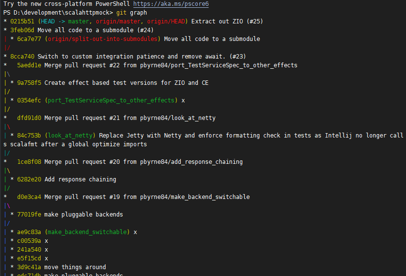
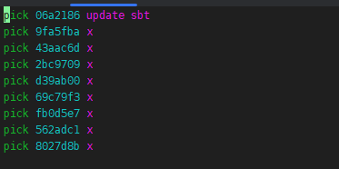
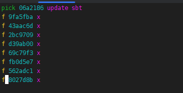

# Git Rebase

Rewriting history, so we can at least pretend to be coherent creatures.

**Do not do this on a shared branch without communication with all users of that branch**

## Why do we want to do this?

In reality, when we work, it is fairly chaotic. At the end of a task, our commit history can be all over the place. It is
no use to anyone and makes git annotate useless to get an overview of what was done and why. I generally annotate to find
out what task/story instigated that piece of code to be written. Getting *x* or *wip* back just makes that a lot more
difficult.

It is not about blame, it is about ease of verification. We share culpability for more things than the direct thing we
are working on. Making things hard just means they will not be done.

## Git graph alias (make looking at git commit history prettier on the command line)

(Windows replace ' with ")
```shell
git config --global alias.graph 'log --oneline --abbrev-commit --all --graph --decorate'
```



Each indentation level is a branch. Sometimes merge commits infect things and break rebasing/githubs ability. Instead of 
merging from main into the branch I am working on I will use 

```shell
git rebase origin/main
```

I will usually squish my branch down before I do this as it will deal with conflicts per commit, so if you have been
changing your mind a lot there may be needless conflicts to deal with.


## Interactive rebase (-i)

This allows you to squish commits and rewrite commit messages. I use this instead of amend message.

* **git rebase -i origin/main** - Enables to rebase all commits up to the main branch
* **git rebase -i HEAD~3** - Enables rebase of the last 3 commits

### Using VIM

VIM is quite alien to use at first. You need to switch between operating modes. To actually start typing, you need to switch
to interactive mode by pressing **i**. I forget this quite a lot and trigger interactive mode by typing a word with **i**
in it.

When in interactive mode we need to press Escape to get out to do things like the following
* Save and quit - **:wq** and then **Enter**
* Just quit - **:q** and then **Enter**
 
(: and then q) etc.

There are jokes about quitting out of VIM <https://thenewstack.io/how-do-you-exit-vim-a-newbie-question-turned-tech-meme/>

### Example

Here I have a branch that I have done 

```shell
git rebase -i origin/main
```

And it has opened VI (Oh Noes :))



We then switch to interactive mode with the **i** key.

On this screen we cannot actually change the messages, what we can do is denote each commit instead of **pick** with the 
following.

* p - keep/pick
* r - rewrite message
* f - just squish down with no reference in commit message
* s - squash with reference in commit message

Often I will just use **f** on everything but the first commit and then all changes are just put under that commit.



Then press **Escape**

and type **:wq** and then **Enter**


to save and quit then force push

```shell
push -f
```

**Again don't do this on a shared branch**


