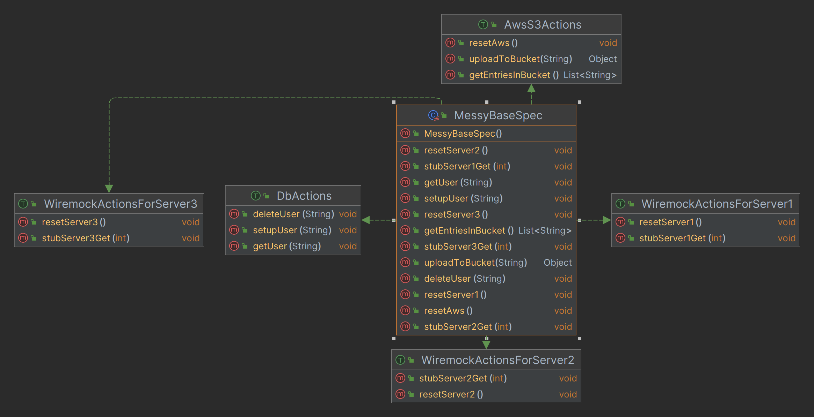
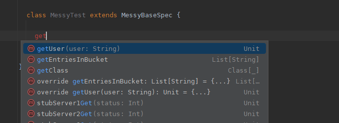
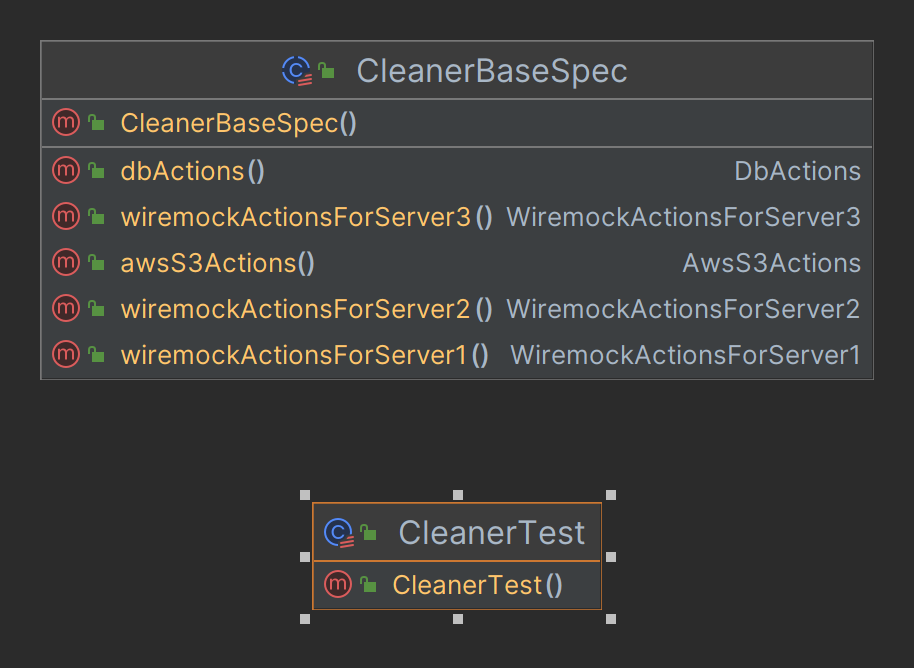
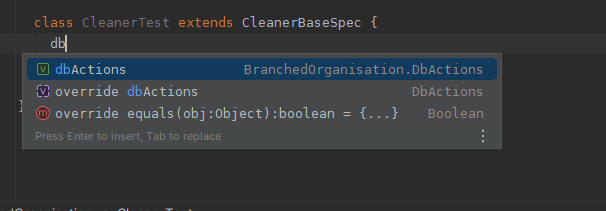
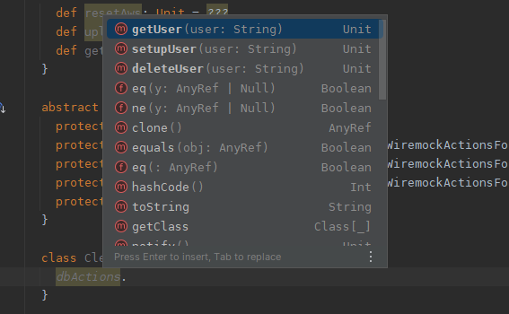

# How The Organisation Of Things In The Current Scope Of Our Code Affects Our Ability To Deliver
(Intellij ultimate can do class diagrams from your code which I will use for pictures)

The questions are
```
Why are you having to open an implementation to refer to it?
Can things be done in a way where this is not needed?
```

We would tire ourselves out very quickly if we had to open all implementations we use (think map operation on List etc). Could it 
indicate our organisational skills are being used poorly? Are we getting lost in what we are doing all the time as we are going 
blind looking at code needlessly? I get code blind with things opening and closing all the time.

Usually this happens a lot in test harness organisation. Tests can be viewed as a chore, making it harder to notice when they 
become a real chore.

## Too many things in the current code scope, impossible to remember, broken muscle memory

At the start of our project when it is empty, we can go fast as things are light. There are custom few files to have to refer to, 
we are at a point working from memory is easy, we are not overloaded by unneeded context all the time. We are also at the point
where we probably don't think that much about organisation as we can do things like just use inheritance all the time for re-use
(over abusing traits in an opportunistic fashion) etc. I catch myself doing it, I quite often wrongly intuitively go for it after 20 years
as I believe I can re-organise it better later. 

Unfortunately, bad habits breed in an application owned by a team and this pattern does get taken to the point of destruction.
I might be able to clean it up, but by that time it is a much bigger headache, with a much bigger discussion.

In an ideal world, you would not have to open files to refer to them all the time. Though it is less of an issue with technologies
that are common as absorption will happen over time, a much bigger issue for custom logic that has people coming in and out of projects
as it will have a very large absorption time and in that time muscle-memory will be fairly useless. That slows people down and makes 
programming a lot less fun. Like wearing concrete boots when swimming. To many files open, too much context all the time from autocomplete
being swapped, increased tiredness.

Writing software is about being able to maintain pace. If we organise things in a way that gets us tired, how long we can go for is affected.
Also, when we are tired, we make mistakes. 

## Think of classes as ways to help with mental categorisation and branch points we can refer to easily from memory

In the dawn of time, people programmed using things like memory addresses and line numbers (BASIC). Instead of calling a procedure by
name, you would refer to it by line number using a GOSUB or a GOTO. Being able to easily memorise this information was key to being able 
to do anything. Not everyone has that type of memory, or wants that type of memory as over remembering things has its own costs.

Then came structured programming <https://en.wikipedia.org/wiki/Structured_programming>. This is the common pattern in procedural programming.
Using procedures, maybe procedures in modules to help with namespacing. This helped, but as software got more complicated discoverability of
needed function calls got harder as things get lost in noise. The need to heavily memorize starts to seep in and the person with the best memory tends
to be able to perform the best.

Though move that person to a different environment, they will be nerfed until they get to that point again. 
This affects the ability to move people between projects and time needed to get new people productive. In fact, productive can get to 
the point no-one really is that productive. Why some people like green field projects, though it would be better for them to learn how 
not to get to that point so the new projects don't end up the same.

OO is about real world modelling, though it can fail when getting exotic with inheritance. The classic problems such as say modelling birds. We
have a fly() on the base Bird interface, and then we get to penguins. We now have hit concepts like FlyingBird, SwimmingOnlyBird and FlyingSwimmingBird.
Using inheritance for this gets very tricky and can create a lot of mess. Enough mess that people get religious against any inheritance.

What we can take away from it is how at a basic level it can help with classification. We can view classes as genus and methods as lower classifications.
I need something in the Amanita family, I can refer to the aminita instance and find something that looks like what I want. I might not actually know the exact
name, but I will know it when I see it. There are a lot of members in that family, importing all the options into root scope as methods/functions just makes autocomplete
far less usable due to the massive about of extra choices that have been inserted in scope. Also, you have to be a lot more precise to get the thing
you want.

### An example of flat organisation getting harder 

Just because it is in another file does not mean it is organised, can be just squirreling things away.

```scala
object FlatOrganisation {
  trait DbActions {
    def setupUser(user: String): Unit = ???
    def getUser(user: String): Unit = ???
    def deleteUser(user: String): Unit = ???
  }

  trait WiremockActionsForServer1 {
    def resetServer1: Unit = ???
    def stubServer1Get(status: Int): Unit = ???
  }

  trait WiremockActionsForServer2 {
    def resetServer2: Unit = ???
    def stubServer2Get(status: Int): Unit = ???
  }

  trait WiremockActionsForServer3 {
    def resetServer3: Unit = ???
    def stubServer3Get(status: Int): Unit = ???
  }

  trait AwsS3Actions {
    def resetAws: Unit = ???
    def uploadToBucket(value: String) = ???
    def getEntriesInBucket: List[String] = ???
  }

  class MessyBaseSpec
    extends DbActions
      with WiremockActionsForServer1
      with WiremockActionsForServer2
      with WiremockActionsForServer3
      with AwsS3Actions

  class MessyTest extends MessyBaseSpec {}

}

```

Is actually modelled as 

All the methods of the traits are copied in as procedures to be used in a procedural fashion. Nothing is no longer easily callable from a 
branch point. We want a get operation, we type get and we get the following autocomplete options

. 

Worse, unless we have added context to the method names
with say prefixing we have no clue what they are doing. getUser? getUser gets a user from where. This is the start of the unfun path of having
to open files needlessly, unless this is refactored things will get less fun. Even if you are not having fun, you can always have less fun :)

This will only get worse over time as new functionality is added until there can be 100+ options each time you want to do something.

Static imports have the same issue. Loose context by removing the class reference. When the imports are wild carded things can get very
finger twisty and pretty impossible to remember as well unless you are using said technology constantly. WireMock imports a lot in to scope
and I have to always refer to the documentation. I have been using WireMock for years. Just organises as Bleurgh in my brain and gets
discarded. More interesting things to brute force remember.

Makes reading the code much harder to follow as people have to open stuff up to understand it. Not that fun in PR's.

My favourite test anti pattern
<http://xunitpatterns.com/Obscure%20Test.html>

### Organised non flat in a fashion that aids memorisation due to having clean domain branching points

```scala
object BranchedOrganisation {
  class DbActions {
    def setupUser(user: String): Unit = ???

    def getUser(user: String): Unit = ???

    def deleteUser(user: String): Unit = ???
  }

  class WiremockActionsForServer1 {
    def resetServer: Unit = ???

    def stubServerGet(status: Int): Unit = ???
  }

  class WiremockActionsForServer2 {
    def resetServer: Unit = ???

    def stubServerGet(status: Int): Unit = ???
  }

  class WiremockActionsForServer3 {
    def resetServer: Unit = ???

    def stubServerGet(status: Int): Unit = ???
  }

  class AwsS3Actions {
    def resetAws: Unit = ???

    def uploadToBucket(value: String) = ???

    def getEntriesInBucket: List[String] = ???
  }

  abstract class CleanerBaseSpec {
    protected val dbActions = new DbActions
    protected val wiremockActionsForServer1 = new WiremockActionsForServer1
    protected val wiremockActionsForServer2 = new WiremockActionsForServer2
    protected val wiremockActionsForServer3 = new WiremockActionsForServer3
    protected val awsS3Actions = new AwsS3Actions
  }

  class CleanerTest extends CleanerBaseSpec {}
}
```

Context is held in the field names. We just need to remember the contexts related to the test such as DB, AWSS3 etc. and
logic we want is easily findable. We only have to remember 5 things, this can absorb into muscle memory very fast, and we
do not have to concern ourselvs with actions unrelated to the context we want to operate in. Also new contexts get added 
quite slowly, for example maybe SQS over time.

We only don't care about method name uniqueness (resetServer2 can now be resetServer) as we do not worry about conflicts.
Makes naming easier.

Model we now have to maybe remember.




Autocomplete can work more intuitively



If we named the instances well we can just say "Have I anything db related to start from?". No need to open anything.
We can intuitively start writing the test. Maybe no extra files are needed open. "Yay!" I hear you cheer. Nice to be able
to focus on doing the test easily. I get distracted looking at stuff, I spot less than ideal patterns etc.
Nice to pretend they do not exist for a while, out of sight out of mind :)

And when we want to see all the db actions available, so we can make a decision on whether we have something already usable which
is quite often a question we have. Every git update changes things so easy of discoverability is important. We organise in a way
that makes our tooling more effective to get around this.




