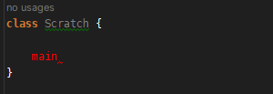

# IntelliJCheatSheet - Live Templates

Intellij has a set of built-in templates, you can also add your own. These do not just enable you to go fast but also 
have common actions across languages. When working across languages, muscle memory can start to trip up. For example, 
flicking between a language that requires semicolons and one that does not then 

**complete statement Cmd-Shift-Enter (Ctrl-Shift-Enter)** helps as it will do that stuff automatically.

## How to find the live templates

Go to settings (Cmd-, or Crtl-Shift-s) 

## Examples of built-in ones

The language of a template is defined in the 

**Applicable in Java: declaration.** 

Section under the template code. I will talk more about this when detailing creating custom templates.

### Example, the joy of main methods

### Java main

Typing the java main dance out is boring. Simply type **main** and then tab.

Then this appears 

Java has **sout tab** for **System.out.println**

### Scala main

This is the same as the Java one, main and then tab.

## Examples of custom ones I set

### `this.` concept across languages

So you are doing javascript and python at the same time. Both require a liberal use of their **this** reference. You end
up typing **self** in javascript and **this** in the python. Hands feel like they are jumbling around. I solve this 
with a custom live template per language, I can then flick the correct one out with the same hand roll so muscle memory 
can act fluidly.

**. then , then space** is what I use as hand movement is limited and easy to be accurate. It is really boring and also 
tiring to type **this** and **self** all the time.

#### Javascript this.

#### Python self:

### Scala for comprehension

Unless the yield is added, then Intellij gives weird errors which can confuse people. I also spell yield wrong enough 
times, so it helps with that.

## Example: Creating a new template (make logging warnings easier)

Like the **this** shortcut, logging is a shared concept with different implementations per language, **warn** versus 
**warning** in this case. Plus going through an application with no logging (unfortunately too common), and having to 
add it everywhere this makes things a bit less tiring.

### Step 1 - Choose the section where you want to add and click the **plus** symbol on the right.

**Note** selecting the section does not set the language. A bit of a gotcha.

### Step 2 - Create a live template that does Python warning logging

 

* We have put it in the Python group for collation purposes (as stated no effect on assigned language)
* We have used **lw** then **Tab** for **logging.warning($VALUE$)**
* **$VALUE$** is where the cursor ends up to aid filling it. **$VALUE$** is a human reference and can be anything. 
  There can be multiple marker points to tab through when filling a template's values.
* Set to applicable in Python underneath. This activates it in the desired context.

 