# IntelliJCheatSheet

I personally add CTRL mappings as well to the CMD ones on Mac otherwise all my muscle memory gets destroyed for Linux/Windows.
Ctrl is also easier to hit on a normal keyboard (ctrl-shift versus cmd-shift, ctrl-z etc).

Typing does not equal doing, but can feel good, we can feel effective when we are not. Being effective comes from 
self-analysis and good feedback from trusted sources. Not from Jira ticket completion. A mess can be hidden behind
each closed Jira ticket.

Typing but not achieving anything.


Fran from Black Books, no clue what she has to do as she was never told, just looking busy.


## Keymaps
Keymaps can be found here
<https://resources.jetbrains.com/storage/products/intellij-idea/docs/IntelliJIDEA_ReferenceCard.pdf>

<https://www.jetbrains.com/help/idea/reference-keymap-mac-default.html>

<https://www.jetbrains.com/help/idea/reference-keymap-win-default.html>

Or simply open Cmd-Shift-A "keyboard" and you should see "Keyboard Shortcuts PDF" in the list of options.
On Mac's things can get a bit random so some things may be like Linux/Windows. Historically, this is how things were, but
people asked for keymaps to be OSX centric when coming to WebStorm etc. so there was a divergence.

## Tips
### Turn on function keys as default instead of Touch-bar etc. as hitting Fn key will be highly contorting and make things uncomfortable
Hints for MacBook owners, turn on function keys as F2(next/previous highlighted error), shift-F6(rename) and alt-f7 (find usages) 
are your best-est friends. Hitting Fn key is very uncomfortable, and hitting the function keys should be the same as hitting
any other key. How often do you really need to change volume control etc.? Find usages alone is a multi use per hour action.

**System settings->keyboard->touchbar settings**


Sometimes different is just differemt for the sake of it.

### Cmd+Shift-A (Ctrl-shift-a on Linux and Windows)
Cmd+Shift-A is the most useful shortcut as it helps you find and use any command (displays shortcut as well). On Windows/Linux 
it is ctrl-shift-a

On the Mac also
<https://intellij-support.jetbrains.com/hc/en-us/articles/360005137400-Cmd-Shift-A-hotkey-opens-Terminal-with-apropos-search-instead-of-the-Find-Action-dialog>
```
Cmd+Shift+A hotkey opens Terminal with "apropos" search instead of the Find Action dialog
```

### Default back to Intellij file browser in OSX
I prefer the Jetbrains file browser as it has buttons to go to the location of the current project and can type
in the path without doing CND-SHIFT-G etc. Finder feels pre-windows XP in design and usability.

**ide.mac.file.chooser** off

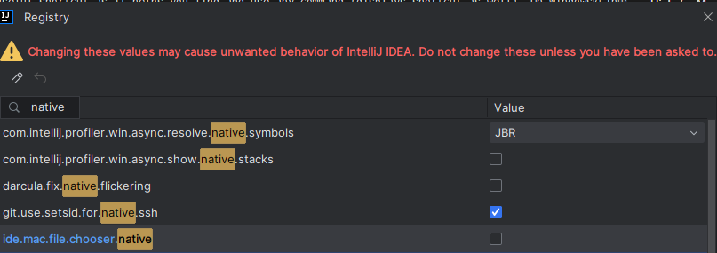

What the Intellij file browser looks like  
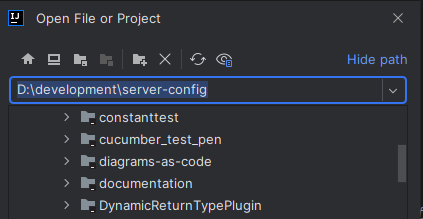

Options at the top are
* Home directory
* Desktop directory
* Project directory (I use this a lot a usually I want to navigate to a sibling project that is not in my recent history easily)
* Module directory
* New directory
* Delete
* Refresh
* Show hidden files and directories (Also very useful)

As the path can also always be shown it makes it easy to copy it.


## Most used keyboard shortcuts
Alt is the weird track like key near command on the Mac (using Alt is too simple)
<https://setapp.com/how-to/how-to-find-the-alt-key-on-mac#:~:text=The%20Alt%20Key%20is%20the,back%20to%20these%20functions%20later>.

Learning these frees up the left panel from having to have project view open (mouse navigating is not scalable) and being able 
to put a terminal/debugger/test run thing there as well. Project view just becomes an occasional reference point.

Think of this as learning movements that can be strung together that enable great speed. Using the keyboard is percussive.
When using keyboard shortcuts, it is like playing chords. Multiple keys together to create something greater than their sum.
I feel my brain change when I pick up a mouse as it is more like a stringed instrument, it is more of a bowed 
motion with less accuracy. 

Trackpads of any form just feel bad, okay for browsing, useless for any speed due to their lack of 
fast accuracy. Mouse you can achieve a sense of hectic playing, touchpads are stuck in a slow symphony.

All pointing devices should be tested for viability by trying to play **Doom Eternal** with them. That is the way :)

If you are good at typing on a laptop and don't have a mouse then this plugin is good to cut down on trackpad usage.
It turns things into a game where your typing can improve with your speed.

**AceJump**

<https://plugins.jetbrains.com/plugin/7086-acejump>

```
AceJump allows you to quickly navigate the caret to any position visible in the editor. See a demo of AceJump in action! Simply hit "ctrl+;", 
type a character, then type the matching character to Ace Jump.
```


### Cmd-Shift-A (Ctrl-shift-A) Run Action

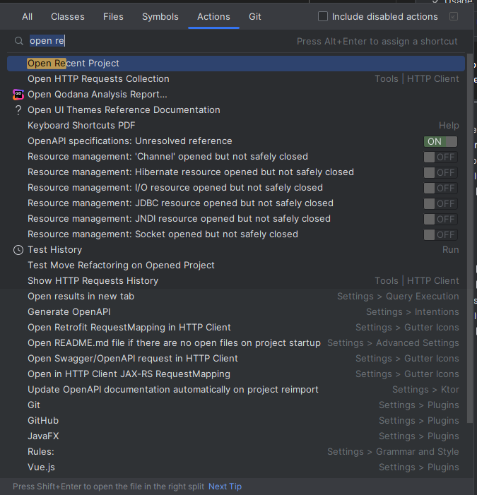


### Alt-F1 show file location
I use this to open the project pain. For example, I will open a file in the location I want a new file in then Alt-F1 and then 
use the keyboard shortcut (CMD-N or Alt-Insert)

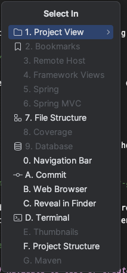

### Ctrl-Shift-F1 New in this directory (Custom binding)
Create file in the directory of the file you are working with. I had forgotten about this.


### F5 Copy the current file and give it a new name
This allows the copy of a class to be used as a template then gutted easily. Using too much of this could be symptomatic
of a need to refactor commonality. Maybe a common base class for things like tests as you can generate the test and select
the base class. Refactoring and bunging things into traits is much less ideal, inheritance is still inheritance, and now
things start to get a lot more murky as things can start to get a lot more complicated over time.

Inheritance takes a while to show its true ugliness. It is highly opportunistic in design and promotes further opportunistic
design. 

The **Tease apart inheritance** refactoring is quite advanced. It can take some people hours, other people days. This leads
to an unneeded high-skill barrier in the project to clean it up.

Scala doesn't really rely on inheritance in a classical sense. Heavy parent objects are frowned upon, but they tend to appear
in tests with the habit of binding in traits to inject a lot of things into the vertical scope, breaking the ability
to mentally collate what is in scope. I will talk about organizing tests in detail elsewhere. Writing a test should be 
as fast and fluid as writing the code when you have little knowledge of either. If you have to keep opening files when
writing tests as the benefit of autocomplete has been depleted, then tests have started to become a boat anchor lowering
velocity.

Well-designed apis don't involve having to open the source code to use them. Plus, having to look at more things can lead to 
being mentally side-tracked from spotting things and adding more things to the todo list which gets very tiring.

The point of this document is to get people to a level where they can do the more advanced workflows with a speed that
won't get complaints/pressure. We often fight the pressure to do a bad job to do things fast, so the requirement is
to become fast enough you have room and have confidence to push back when needed.

### Shift-F6 Rename
I probably use this multiple times on everything. Naming is hard :)

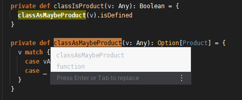

Sometimes it will do it inline though sometimes it will offer a modal. Rename a base class and Intellij will offer renaming of 
any children, etc.

#### Really cool rename usage that saves typing (and spelling issues)
If you choose to rename a variable, then it will give you options based on type

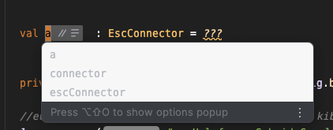

Sometimes you will want to prefix, so you can select the one you want to prefix then I just rename again and add the prefix. Intellij makes my typing so much worse by doing most of the work.

### Cmd-Alt-V (Ctrl-shift-V) Extract variable refactoring (Intellij refers to this as Introduce not Extract)
<https://refactoring.guru/extract-variable>

#### Really cool usage that also saves a lot of typing (even makes java more pleasant)

Instead of typing all of

```scala
val domInputSource = new DOMInputSource
```

you can simply

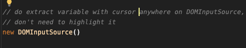

and then

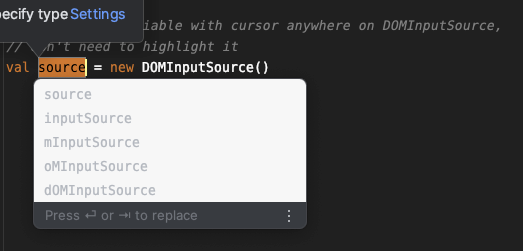
 
or for **Java** instead of typing this adventure

```java
DOMInputSource domInputSource = new DOMInputSource
```


and then it will go to

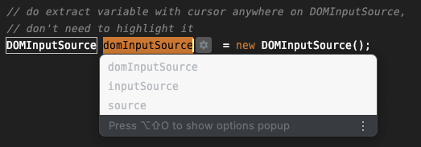 

#### Usual usage
Extracting to a variable can add clarity to the code
<https://refactoring.guru/extract-variable>

We are human, it helps if we communicate our mental journey and thought processes. Giving things 
a nice name helps others(and you 6 months later) to skim code accurately. We spend a lot of our time
saying "this is not what I want" when going through code looking for something, so it is good if we can
speed that up as much as possible by helping things not require unneeded context analysis. I would say make things clear
but that is too woolly, what is clear after 2 hours is very different from after 10 hours due to tiredness.

You can also add breakpoints easily on the extracted value, dump them out with println easily, etc.

### Inline (Ctrl-Alt-N)
<https://refactoring.guru/inline-temp>

<https://refactoring.guru/inline-method>

This is the inverse of **Extract Variable**/**Extract Method**.

You have done an extract variable as you want to println the value or something, now you want to inline it again.

#### Before 
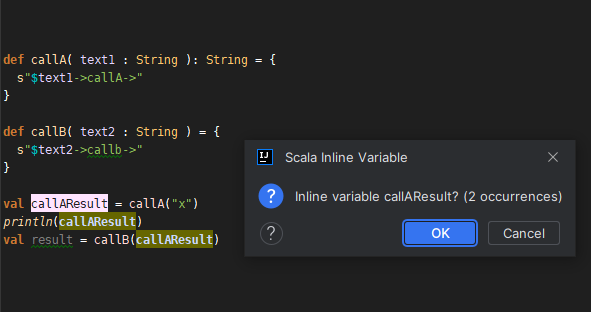

#### After 
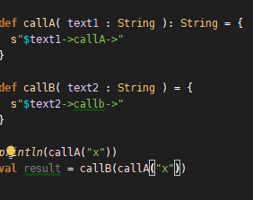

Then I will do delete line on the println. I map this to **ctrl-shift-z** for easy one-handed operation else default is 
**Cmd-Backspace** or **Ctrl-y**


### Extract method Cmd+Alt+M (Ctrl+Alt+M)

There is too much going on in a method. It is making you feel like you need to be needlessly smart. That is a waste of
energy that can be used elsewhere. You also know bugs happen because of nuance, and confusion hides nuance. With good
ordering of methods (linear in call order) it also helps with giving an overview of what a class does.

A lot of stuff happening, too much indentation/levels of operation.

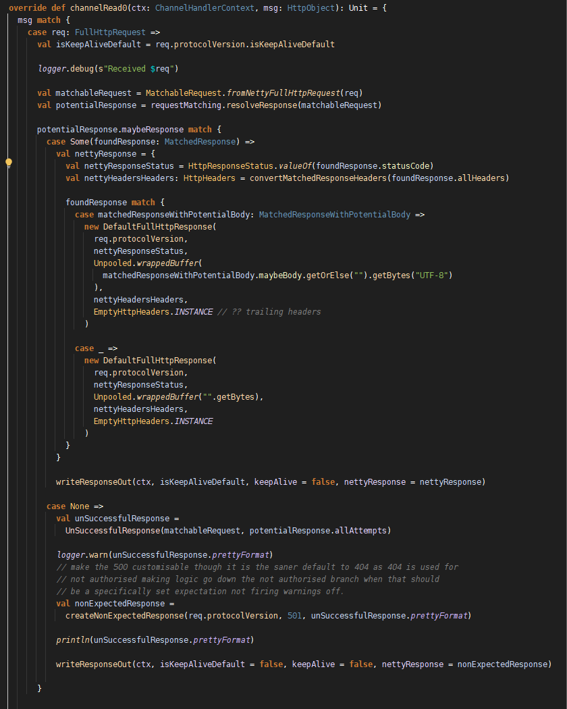

After extraction (convertMatchToNettyResponse)
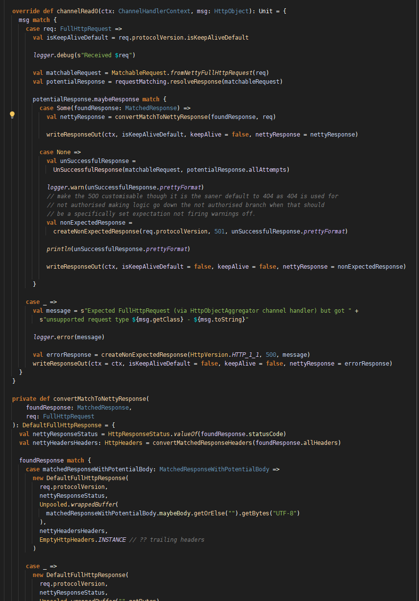

If you do not care about the logic of the response conversion, it is very easy to skim over. Being able to skim things
safely is important. If we can't, then it becomes very tiring to verify behaviour. 

Extract method also ties into things
like dealing with arrow code (<https://blog.codinghorror.com/flattening-arrow-code/>) where it requires getting into 
someone else's flow state to understand what they did. Usually I operate on a similar rule set where if I hit 3 levels 
of indentation, I will think of extracting things out as I start giving myself a headache at that point and links to
a common practice of [CodeStructure-Ordering.md](CodeStructure-Ordering.md) to aid speed and effort of comprehension.

Also with **Scala** and monads extracting methods helps to keep signatures under control. Having a complicated body and
ending up with **F[Any]** is hard to deal with. Usually I extract things out as if I find things hard other people will
find it hard. **Scala** gets accused of being a complicated language, though this can be helped a lot with better writing
style. Anything can be made needlessly complicated if the only thing people care about is getting that closed Jira
ticket dopamine rush.

### Alt+F7 Find usages
This will find all the usages of something by type (method/class etc.). In the results pane, there is an eye symbol that allows changing of 
grouping options

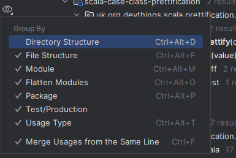

Usually I group tests and production as separate, this reduces the visual noise caused by test calls when looking for production 
calls and vice versa. Plus, it is always nice to see when things are not called in tests (sarcasm not nice).

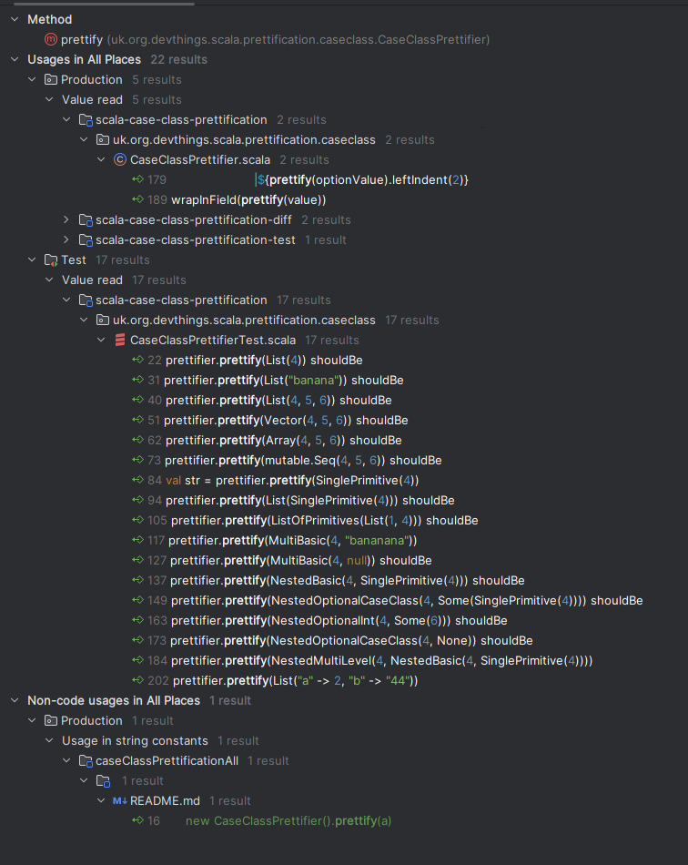

### Cmd-Shift-T (Ctrl-Shift-T) Navigate to test or create test if one does not exist.
(also navigates from the test to the tested code)

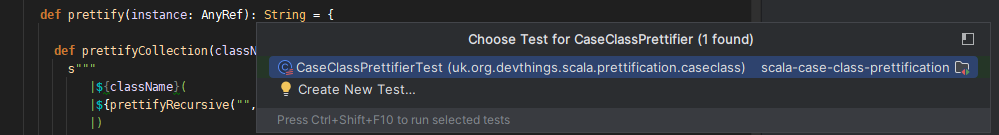

This is very useful to know for the reason that actually doing things like sprout class refactorings
http://xunitpatterns.com/Sprout%20Class.html

Quite commonly we come across a piece of code (fat controllers prime example) where people just keep adding code as they
are too slow to actually refactor. They are too slow to refactor due to lack of practice and lack of practice stops 
them getting practice. The outcome of this is that the test cases get holey due to the complication needed to actually test the boundaries.
Correct has a lot of definitions when all the negative outcomes start being taken into account.

### Cmd+E (Ctrl-E) Navigate to recent files
Used instead of tabs at the top. 

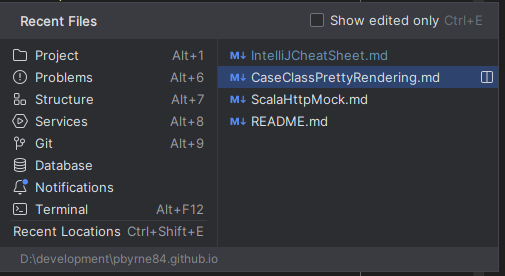

This greedy searches so typing things like ee with match this filename in the list. Plus you can flick between files as the 
previous file will be first selected.

### Cmd-O (ctrl-N) Navigate to class/trait etc.
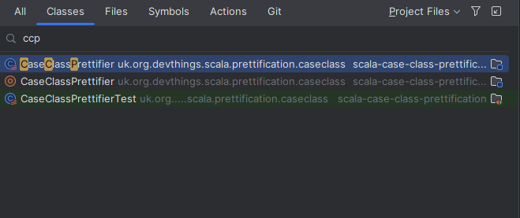

This **command** greedy matches as well so doing things like just the letters of each word will match. It matches better than
I can type. Pressing the shortcut again will include non-project classes (libraries/java lib etc).


### Cmd-Shift-O (ctrl-shift-N) Navigate to file
Similar to navigate to class, but a lot more eye noise.

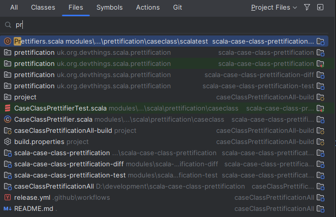

### Shift-Shift Navigate all


I just use this shortcut for methods/symbols as it is CMD-SHIFT-ALT-O is a bit too contortionist. You could use this keyboard
shortcut instead of the more refined ones, but you may give yourself a headache without realizing why. I give myself
lots of headaches, the potential of headaches gives me headaches.

### Open Recent Project (CMD-Shift-A Open Recent)
Lists the recent projects you had open which allows you to re-open them quickly.


### Extend selection/Deselect selection Cmd-up/Cmd-down (ctrl-w/ctrl-shift-w)
I add the Windows/Linux shortcuts to the Mac as they are one-handed and I use them a lot. Plus, I end up hitting Cmd-R
as using Cmd and Ctrl can feel like a 50-50 mix up in the OSX keymap and I end up closing the file when I hit Cmd-w as 
Ctrl-w did not work.

50-50 mixup is a fighting game term when luck versus skill is involved, it is not regarded as good design. 

## Running tests/Run actions
I am a fan of only running the test/tests I am focussing on. The reasons for this is tests can and often bleed into other tests.
A recent example was that the guice builder was setting the url prefix (a static var) in one test and that was being relied on another 
test. Not fun when the other test fails and you cannot debug easily. Having to run all the tests while trying to debug one thing
just makes a headache a cluster headache trying to work out how things are tangled. I had to tag all the tests and whittle it down 
one by one to find the interaction. These interactions are an example of Murphy's law.

It gives me an idea for a sbt plugin that individually runs changed test cases to detect contamination. Though it would
slow down builds due everything having to hard restart.

### Ctrl-Shift-R/Ctrl-R (Ctrl-shift-F10/Shift-F10)

**Cmd-Shift-R** will run what is selected. If in a test case it wil run the grouping you have selected in WordSpec etc.
For example in WordSpec you can divide things up per method nicely etc. and only run those tests easily.

**Cmd-R** will run what was previously run. This is really handy when doing TDD as you can write the test, then **Cmd-Shift-R** to 
get it to fail and then when the implementation is done **CMD-R** without navigating from the code. Really helps with raising tempo.
As pointed out before as you now know how to do all the navigation by keyboard the test window can take your pride of place :).


### Pinning a test run (right click tab)
You have a problem that affects many tests. It could be from upgrading a library or something. The command line is a sea of red.
The tests play nicely with Intellij/IDE's and every test case can be run and debugged happily in isolation. Trumpets from the heavens can be heard.
Something totally un-fun is now just possibly un-fun.

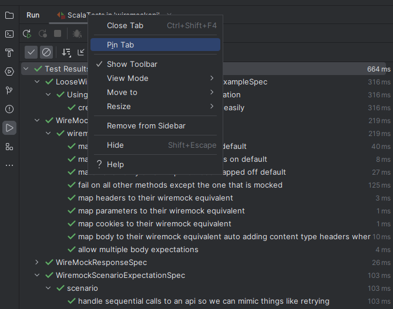

When a tab is pinned the next time a test is ran it will open a new tab. This allows you to keep track of all the original failures
but not get bogged down by their line noise while fixing other things. You can then re-run the pinned panel by clicking the re-run
after a bit of cleaning up so the red gets less and less in a controlled fashion and doesn't feel too much or feel too exciting.
Things feeling too exciting can be a bad sign as it means it is consuming a lot of energy.