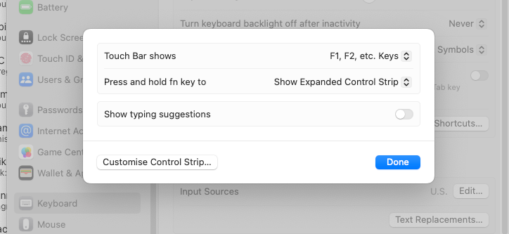
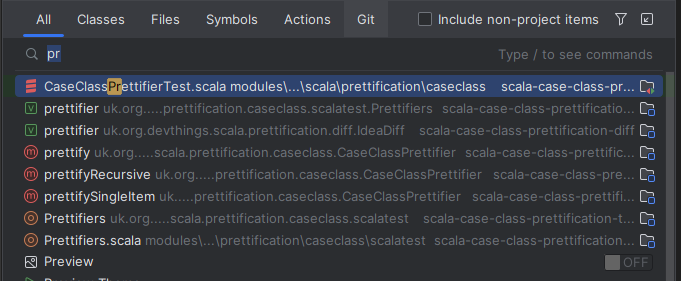

## IntelliJCheatSheet

I personally add CTRL mappings as well to the CMD ones on Mac otherwise all my muscle memory gets destroyed for Linux/Windows.
Ctrl is also easier to hit on a normal keyboard (ctrl-shift versus cmd-shift, ctrl-z etc).

## Tips
### Turn on function keys as default instead of Touch-bar etc. as hitting Fn key will be highly contorting and make things uncomfortable
Hints for MacBook owners, turn on function keys as F2(next/previous highlighted error), shift-F6(rename) and alt-f7 (find usages) 
are your best-est friends. Hitting Fn key is very uncomfortable, and hitting the function keys should be the same as hitting
any other key. How often do you really need to change volume control etc.? Find usages alone is a multi use per hour action.

**System settings->keyboard->touchbar settings**



Sometimes different is just differemt for the sake of it.

### Cmd+Shift-A (Ctrl-shift-a on Linux and Windows)
Cmd+Shift-A is the most useful shortcut as it helps you find and use any command (displays shortcut as well). On Windows/Linux 
it is ctrl-shift-a

On the Mac also
<https://intellij-support.jetbrains.com/hc/en-us/articles/360005137400-Cmd-Shift-A-hotkey-opens-Terminal-with-apropos-search-instead-of-the-Find-Action-dialog>
```
Cmd+Shift+A hotkey opens Terminal with "apropos" search instead of the Find Action dialog
```

### Default back to Intellij file browser in OSX
I prefer the Jetbrains file browser as it has buttons to go to the location of the current project and can type
in the path without doing CND-SHIFT-G etc. Finder feels pre-windows XP in design and usability.

**ide.mac.file.chooser** off


What the Intellij file browser looks like  


Options at the top are
* Home directory
* Desktop directory
* Project directory (I use this a lot a usually I want to navigate to a sibling project that is not in my recent history easily)
* Module directory
* New directory
* Delete
* Refresh
* Show hidden files and directories (Also very useful)

As the path can also always be shown it makes it easy to copy it.


## Most used keyboard shortcuts
Alt is the weird track like key near command on the Mac (using Alt is too simple)
<https://setapp.com/how-to/how-to-find-the-alt-key-on-mac#:~:text=The%20Alt%20Key%20is%20the,back%20to%20these%20functions%20later>.

Learning these frees up the left panel from having to have project view open (mouse navigating is not scalable) and being able 
to put a terminal/debugger/test run thing there as well. Project view just becomes an occasional reference point.

### Keymaps
Keymaps can be found here
<https://resources.jetbrains.com/storage/products/intellij-idea/docs/IntelliJIDEA_ReferenceCard.pdf>

Or simply open Cmd-Shift-A "keyboard" and you should see "Keyboard Shortcuts PDF" in the list of options.

### Cmd-Shift-A (Ctrl-shift-A) Run Action


### Alt-F1 show file location
I use this to open the project pain. For example, I will open a file in the location I want a new file in then Alt-F1 and then 
use the keyboard shortcut (CMD-N)


### Shift-F6 Rename
I probably use this multiple times on everything. Naming is hard :)


Sometimes it will do it inline though sometimes it will offer a modal. Rename a base class and Intellij will offer renaming of 
any children etc.

#### Really cool rename usage that saves typing (and spelling issues)
If you choose to rename a variable then it will give you options based on type


Sometimes you will want to prefix, so you can select the one you want to prefix then I just rename again and add the prefix. Intellij makes my typing so much worse by doing most of the work.

### Cmd-Alt-V Extract variable refactoring 

#### Really cool usage that also saves a lot of typing (even makes java more pleasant)

Instead of typing all of

```scala
val domInputSource = new DOMInputSource
```

or 

```java
DOMInputSource domInputSource = new DOMInputSource
```

you can simply


or for java 


### Alt+F7 Find usages
This will find all the usages of something by type (method/class etc.). In the results pane, there is an eye symbol that allows changing of 
grouping options


Usually I group tests and production as separate, this reduces the visual noise caused by test calls when looking for production 
calls and vice versa. Plus, it is always nice to see when things are not called in tests (sarcasm not nice).


### Cmd-Shift-T (Ctrl-Shift-T) Navigate to test or create test if one does not exist.
(also navigates from the test to the tested code)


This is very useful to know for the reason that actually doing things like sprout class refactorings
http://xunitpatterns.com/Sprout%20Class.html

Quite commonly we come across a piece of code (fat controllers prime example) where people just keep adding code as they
are too slow to actually refactor. They are too slow to refactor due to lack of practice and lack of practice stops 
them getting practice. The outcome of this is that the test cases get holey due to the complication needed to actually test the boundaries.
Correct has a lot of definitions when all the negative outcomes start being taken into account.

### Cmd+E (Ctrl-E) Navigate to recent files
Used instead of tabs at the top. 


This greedy searches so typing things like ee with match this filename in the list. Plus you can flick between files as the 
previous file will be first selected.

### Cmd-O (ctrl-N) Navigate to class/trait etc.


This command greedy matches as well so doing things like just the letters of each word will match. It matches better than
I can type. Pressing the shortcut again will include non-project classes (libraries/java lib etc).


### Cmd-Shift-O (ctrl-shift-N) Navigate to file
Similar to navigate to class, but a lot more eye noise.


### Shift-Shift Navigate all


I just use this shortcut for methods/symbols as it is CMD-SHIFT-ALT-O is a bit too contortionist. You could use this keyboard
shortcut instead of the more refined ones but you may give yourself a headache without realising why. I give myself
lots of headaches, the potential of headaches gives me headaches.


### Open Recent Project (CMD-Shift-A Open Recent)
Lists the recent projects you had open which allows you to re-open them quickly.


## Running tests/Run actions
I am a fan of only running the test/tests I am focussing on. The reasons for this is tests can and often bleed into other tests.
A recent example was that the guice builder was setting the url prefix (a static var) in one test and that was being relied on another 
test. Not fun when the other test fails and you cannot debug easily. Having to run all the tests while trying to debug one thing
just makes a headache a cluster headache trying to work out how things are tangled. I had to tag all the tests and whittle it down 
one by one to find the interaction. These interactions are an example of Murphy's law.

It gives me an idea for a sbt plugin that individually runs changed test cases to detect contamination. Though it would
slow down builds due everything having to hard restart.

### Ctrl-Shift-R/Ctrl-R (Ctrl-shift-F10/Shift-F10)

**Cmd-Shift-R** will run what is selected. If in a test case it wil run the grouping you have selected in WordSpec etc.
For example in WordSpec you can divide things up per method nicely etc. and only run those tests easily.

**Cmd-R** will run what was previously run. This is really handy when doing TDD as you can write the test, then **Cmd-Shift-R** to 
get it to fail and then when the implementation is done **CMD-R** without navigating from the code. Really helps with raising tempo.
As pointed out before as you now know how to do all the navigation by keyboard the test window can take your pride of place :).


### Pinning a test run (right click tab)
You have a problem that affects many tests. It could be from upgrading a library or something. The command line is a sea of red.
The tests play nicely with Intellij/IDE's and every test case can be run and debugged happily in isolation. Trumpets from the heavens can be heard.
Something totally un-fun is now just possibly un-fun.


When a tab is pinned the next time a test is ran it will open a new tab. This allows you to keep track of all the original failures
but not get bogged down by their line noise while fixing other things. You can then re-run the pinned panel by clicking the re-run
after a bit of cleaning up so the red gets less and less in a controlled fashion and doesn't feel too much or feel too exciting.
Things feeling too exciting can be a bad sign as it means it is consuming a lot of energy.