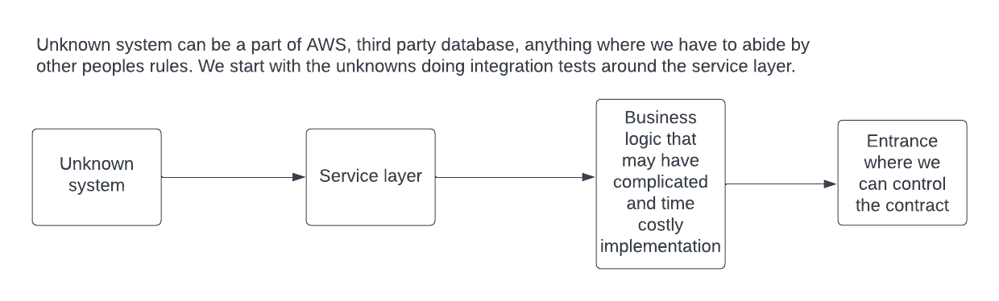

# Scala Tagged Types/Opaque Types

An example of how we can tie this into an Akka Http API, this allows us to get informative API errors can be found in 
[ScalaCirceErrorHandling.html](ScalaCirceErrorHandling.html). This allows us to move some validation to the api entrance
stopping us needing to worry about it later.

When we are building distributed automated systems managed by many teams, we will face the situation of systems calling
us that behave badly and also systems we call behaving badly. Often the owners of those systems will have no idea, and 
we will need to reach out to them to inform them of what is happening. It is good if we have good quality information
when we reach out, such as having all invalid values as this allows them to fix everything in one go with minimal meetings. Ideally
no meetings. Building systems that require minimal meetings and cross-team chatter :)

Less meetings, more development.

## Data Stringency
Data stringency is something that is often overlooked due to the effort it takes in most languages. Scala makes this very 
easy. The happy paths of 2 systems developed by 2 teams may be the same, the unhappy paths which affect the cost of ownership
will be very different as people are generally happy focussed. If engineers appear negative, that is because they have to 
take into account negative paths, and usually there are more negative paths than positive ones.

Making unhappiness clear aids in maintaining a sense of happiness. From a human perspective, the mental effort to work something
out can impact far longer than the time it takes. Businesses think in terms of time as that is what they pay for, there is 
no way to collate the further time lost when trying to context switch back to something else. Not all distractions are 
equal even though they may have the same duration.

Data stringency ties into <https://en.wikipedia.org/wiki/Defensive_programming>.
It also ties into a fail fast philosophy <https://en.wikipedia.org/wiki/Fail-fast> and helps with dealing with primitive
obsession <https://refactoring.guru/smells/primitive-obsession>.

I tend to prefer a "fail in a clear fashion" philosophy, failing clearly usually is failing fast, but we are informative 
what caused the failure. In one of the defensive programming WIKI page "offensive programming" examples it fails, but gives 
no indication of what value caused the problem.

```
const char* trafficlight_colorname(enum traffic_light_color c) {
    switch (c) {
        case TRAFFICLIGHT_RED:    return "red";
        case TRAFFICLIGHT_YELLOW: return "yellow";
        case TRAFFICLIGHT_GREEN:  return "green";
    }
    assert(0); // Assert that this section is unreachable.
    // Warning: This 'assert' function call will be dropped by an optimizing
    // compiler if all possible values of 'traffic_light_color' are listed in
    // the previous 'switch' statement...
}
```
**assert(0)** will halt on a problem, but we have no clue what the value of **c** was that caused the issue. In an ideal
world we would have some logging and the **assert** would fail with an informative error containing the value of **c** in it,
if the assert statement allows it.

## Pushing 
 
## Tagged types and Opaque Types are the same concept
Scala 2 had manual implementation, in Scala 3 it is built in but uses the term opaque types.

## What are they and what are they for?

You want greater compile time safety, possibly greater runtime data stringency with low-runtime overhead.

There is a play on words of the term **Strongly Typed** as **Stringly Typed** <https://wiki.c2.com/?StringlyTyped>. This is 
when we are concerned about the basic type safety, but we have no care about the domain requirements in the type. For example, we are
using a string type that can contain any unicode value with a length set by machine limitations such as available RAM. The end location
of that value only accepts alphanumeric characters up to 300 chars in length, or it will fail. We could check the value on entrance (say api route) and
then trust the value in the call chain. 

In the diagram below, there are three examples of call chains. 

1. The First type of call chain is the most common as we fixate on getting something working versus how it may not work later as 
   things move around. Overly trusting of the caller, if we want to mentally sanity check anything, we have to start travelling up the calls.
   When you own a code base, you can link things in your head and mitigate problems. This does not scale with more people as it does not also 
   live in their heads. This is why mentally linking things is a problem, it relies on us to do work the machines should be doing. 
2. We have coded defensive checks down the call chains. Each method has sanity checking within it, though how they fail the sanity checks may 
   be quite varied. Different methods may not fail informatively, nothing worse than something saying something is wrong but not the exact 
   reproducible cause. A lot of time can be wasted if we do not communicate failure clearly, we start to guess, the more people trying to guess,
   the more stressful things can become.
3. We are no longer using basic types in signatures where we require sanity. The types we are passing handle their own sanity checking, and if things
   expect that custom signature, they are saying I ascribe to these rules and I expect you the caller to as well. The rules carry as the types carry down the call chain.


When dealing with any distributed architecture (microservices etc.) <https://www.atlassian.com/microservices/microservices-architecture/distributed-architecture> we have
each part should be viewed as a highly untrusted foreign entity. Technologies may not be suited to data stringency easily, OpenAPI documentation
can be more of a thing of hope. The language cannot guarantee things null safety and null starts to bleed through in API responses etc. This breaks
calling systems in different ways, sometimes very deep in the calling system such as when it tries to save that value in the DB. That is not a nice 
error to deal with.

Worse, many teams may be involved and invalid values can cascade through systems, meaning many teams have to get involved when issues happen.

In the example below, we can pretend a separate team owns each service. When ServiceA goes boom, they talk to owners of ServiceB, ServiceB then 
have to talk to ServiceC after they work out what actually happened. 3 teams with wasted productivity.


In an ideal world **ServiceC** should have blown up trying to serve the request. There is still distraction, but the owners of ServiceC should be 
aware of the problem before anyone tells them. They should have logs on how there system is infracting their contract, so they should be able 
to fix it. A 500 is better than partially correct data traversing across systems.

One of the main benefits of Scala is its ease with data correctness. Technologies that do not do this easily tend to forgo it with the effort
pushed to the cost of ownership of the solution, often on others over time. Building things is fun, owning things can be much less so due to 
investigating problems. Human cost to own limits the size of a technology estate a team can own. Good practices are built around ownership.
Ownership does not have to be painful.

On a side track there is also telemetry with OpenTelemetry<https://opentelemetry.io/>, Kamon <https://kamon.io/> which has aspects for play etc. and 
ZIO has trace information on the fibres. This ties into things like ZipKin/Jaeger where things are visibly traced through systems. That is another story
though. 

### Building systems by order of risk from unknowns (bit of a sidetrack)

(This probably needs its own page later)
Often we will be faced with a task where we are not gods of the domain. We use third party technologies that dictate their own rules and may 
conflict with the requirements. Likely the technology rules we have to abide by are unknown and hence induce risk to the outcome, we need to
prove we can actually complete the story, so we start there. In this case, automated testing has a prime use for exploration. 

Integration tests are not necessarily inherently slow, but they can be done in a way that makes them slow, for example, starting and stopping
a docker image per test. Usually, their main problem is they can be written in a way that makes debugging failures hard if they are too deep. 
Though this can also be the same issue with too much abstracted mocking. An integration test close to the technology with negligible startup times
is a major benefit. We do not control it, so we need to prove assumptions as that is where bugs like to live. Trust but verify.

**Thinking integration tests are slow by nature, leads to them being slow as people stop investigating why they are slow**. There have been
a number of times I have gone to Jenkins and found test times have shot up. This is a killer to productivity. A DB test took 10 minutes,
I got it down to a couple of seconds as the issue was something to do with the way the scala futures were needlessly blocking each other.
It is always well worth working out why things are slow as maybe we can change those factors, this includes things like production DB stuff.
Databases are one area performance can be raised in large magnitudes if we do things in a way the database likes. Another topic.

Personally, I mostly learn all technologies by using a test environment. It allows me to keep record of what I tried, what works and also
what doesn't work. This ties into tests as documentation. I possibly spend a large amount of time learning something, and it is a good way
for other people to come and learn off my effort and have an environment they have a basis to try things. Helping each other speed up.

So we know what the desired outcome is, we know what data we have available from things like parameters and storage, we can start building
tests to see if we can get the desired outcomes for all circumstances, if not we can communicate early and maybe change tact. Quite often 
things are based on nuance, so we discover things while actually doing.



We can build the service layer first, we use validating types in its signature as it needs to be very clear about its rules, such as max length of a fiekd. 
We do not want 500 errors needless propagating where they do not need to be. We can then propagate that contract upwards as we build towards 
the entrance point where we can communicate breakages of that rule clearly. Plus, if we have the rule in the class interface contract with a self-validating Type,
we do not have to mess around with boundary testing too much. Just boundary test (<https://www.tutorialspoint.com/software_testing_dictionary/boundary_testing.htm>) the type once.

You do boundary test, don't you? ;)

## Benefits of TaggedTypes over Value Classes.

### What is a value class and its limitations?

In Scala a value class extends of AnyVal. Ideally it should not create another heap assignment (use more allocation), but in some cases it does.

Example value class (extends AnyVal versus AnyRef, ref is fore classes, val for values)
```scala
case class SafeString(value: String) extends AnyVal
```

Taken from <https://docs.scala-lang.org/overviews/core/value-classes.html>

```
When Allocation Is Necessary
Because the JVM does not support value classes, Scala sometimes needs to actually instantiate a value class. Full details may be found in SIP-15.

Allocation Summary
A value class is actually instantiated when:

a value class is treated as another type.
a value class is assigned to an array.
doing runtime type tests, such as pattern matching.
```

So if we care about heap allocation, value classes are not childproof.

### The type can be passed to anything that expected the untagged type without effort as the tagged type is a child of the original type.

With the **value class** approach, we would have to call .value to pass it to things that expect strings. A small annoyance but 
it breaks things like smart complete in IDES which creates more manual typing/brain context overhead.


## Other benefits of Tagged Types
Using things like find usages in an IDE, we can find all potential paths that value can go down. This greatly increases the 
speed we can understand a system. We no longer have to drill down and do a game of "follow the string". Find usages of the string
type is very non-productive as there will be thousands.

Smart complete becomes more accurate as no longer do you need to pick through invalid values.

Booleans are fairly horrible in negative outcomes, this is why Intellij always prompts you to use named parameters for them.
More on why Booleans are problematic <https://www.informit.com/articles/article.aspx?p=1392524>. Having the context tied to 
the type makes it very hard to pass it to the wrong thing. We could also use something more like an enum (e.g. TurnOff, TurnOn), 
but tagged/opaque types are another avenue.

## Negatives of TaggedTypes/Opaque types

The type does not exist at runtime. **String with Tag** just becomes **String**. This means we cannot do things like match on 
it. It behaves much like types behave in things like TypeScript. It is for compile time sanity, but they disappear post-compilation 
otherwise they would incur overhead. Though as some technologies have total type erasure a bit here is not such a big deal. 

The factory method that creates a tagged type could return a value class instead at some point if heap allocation is not an issue, and
you want to do things that type erasure blocks.

## How are Tagged Types made?

It is all based on a trick like the following

```scala
trait AnimalTag

"".asInstanceOf[String with AnimalTag]
```

Using **asInstanceOf** we can append an empty trait (no methods etc.) to the type. This is what the Shapeless implementation is doing

<https://github.com/milessabin/shapeless/blob/96444a68060bab96c3871e99b87ee0f8db985747/core/shared/src/main/scala/shapeless/typeoperators.scala#L26>
```scala
object tag {
  def apply[U] = Tagger.asInstanceOf[Tagger[U]]

  trait Tagged[U] extends Any
  type @@[+T, U] = T with Tagged[U]

  class Tagger[U] {
    def apply[T](t : T) : T @@ U = t.asInstanceOf[T @@ U]
  }
  private object Tagger extends Tagger[Nothing]
}
```

## Example of usage
<https://github.com/pbyrne84/pbyrne84.github.io/blob/main/src/test/scala/io/github/pbyrne84/taggedtypes/TaggedTypesSpec.scala>

Manual tagging in Scala2 without a library and opaque types in Scala3.

```scala
package io.github.pbyrne84.taggedtypes

import org.scalatest.matchers.must.Matchers
import org.scalatest.wordspec.AnyWordSpec

class TaggedTypesSpec extends AnyWordSpec with Matchers {

  // https://alvinalexander.com/scala/scala-3-opaque-types-how-to/ good reading

  "Tagged and Opaque types" must {

    "be creatable without a library in scala 2" in {
      // Tagged types work by using .asInstanceOf in the background. As long as a trait does not contain
      // any implementation we can cast something to having that trait
      // It is a variation of marker interfaces https://www.baeldung.com/java-marker-interfaces
      // that give compile time guarantees. The trait is not detectable at runtime.
      // Why use them? Well we can validate on creation meaning this is now a trusted value throughout the
      // system. Used for creation of JSON payloads we can guarantee our payloads fit a contract. The more
      // software we build that has good guarantees with clear failure means the more software we can
      // end up managing in an estate.
      //
      // If we cannot guarantee our contracts it can break things for teams who are quite removed from us.

      sealed trait AnimalTag
      sealed trait CatTag extends AnimalTag
      sealed trait DogTag extends AnimalTag

      // we can find usages of StringCat very easily, simple strings alas no, so helps us collate call paths
      // in business logic.
      type StringCat = String with CatTag

      object StringCat {
        def apply(noise: String): Either[String, StringCat] = {
          if (noise == "meow") {
            Right(noise.asInstanceOf[StringCat]) // this does not add to the heap anymore than the initial string does.
          } else {
            // Either is functional, throwing exceptions much less so as it cannot be reasoned about by signature.
            // This makes it very hard to recover from errors as people have to analyse call chains, call chains
            // also change. Clean code has a good section on checked exceptions which was Java's attempt at
            // clarifying error cases.
            // This will be covered in my error handling stuff.
            Left(s"'$noise' is not a noise cat makes")
          }
        }

        // Just mark it so the import is easily found. Though with these types of imports best to keep away from
        // the main imports and keep them close to use.
        // For example a lot of string operations are added by default by StringOps
        object ops {
          // Scala 2 Extension method teqnuique
          implicit class AnimalStringOps(value: String) {
            def attemptAsCat: Either[String, StringCat] = StringCat(value)
          }

        }

      }

      def onlyAllowCats(cat: StringCat): Either[String, String] = {
        Right(s"cat allowed - $cat")
      }

      def allowString(value: String): Unit = {}

      import StringCat.ops._

      val stringOrCat1 = for {
        stringCat1 <- StringCat("meow")
        stringCat2 <- "meow".attemptAsCat
        result <- onlyAllowCats(stringCat1)
        // StringCat is still passable as String
        _ = allowString(result)
      } yield result

      val stringOrCat2 = for {
        stringCat <- StringCat("woof")
        result <- onlyAllowCats(stringCat)
      } yield result

      stringOrCat1 mustBe Right("cat allowed - meow")
      stringOrCat2 mustBe Left("'woof' is not a noise cat makes")

    }

    "scala 3 has opaque types" in {
      // https://docs.scala-lang.org/scala3/book/types-opaque-types.html
      // https://www.baeldung.com/scala/opaque-type-alias

      object Animals {
        opaque type AnimalTag = String
        opaque type StringCat <: AnimalTag with String = String
        opaque type StringDog <: AnimalTag = String

        // We can directly assign here as within the object scope it is trusted
        // This makes things less boiler plate
        val a: AnimalTag = ""

        object OpaqueStringCat {
          def apply(noise: String): Either[String, StringCat] = {
            if (noise == "meow") {
              Right(noise)
            } else {
              // Either is functional, throwing exceptions much less so as it cannot be reasoned about by signature.
              // This makes it very hard to recover from errors as people have to analyse call chains, call chains
              // also change. Clean code has a good section on checked exceptions which was Java's attempt at
              // clarifying error cases.
              // This will be covered in my error handling stuff.
              Left(s"'$noise' is not a noise cat makes")
            }
          }

          object ops {
            // Scala 3 extension method. The term implicit is no longer used as it is a separate concept.
            // Conflating it with Parameters and Conversions causes negative association.
            // Scala uses extension methods for a lot of things in the background such a "2".toInt
            extension (text: String) {
              def attemptAsCat: Either[StringDog, Animals.StringCat] = OpaqueStringCat(text)
            }
          }

        }
      }

      import Animals._

      def onlyAllowCats(cat: StringCat): Either[String, String] = {
        Right(s"opaque cat allowed - $cat")
      }

      def onlyAllowAnimals(animal: AnimalTag): Either[String, String] = {
        Right(s"opaque animal - $animal")
      }

      def allowString(value: String): Unit = {}

      import Animals.OpaqueStringCat.ops._

      val stringOrOpaqueCat = for {
        stringCat1 <- OpaqueStringCat("meow")
        // This is not used below, just an example of using extension methods as a nicer interface
        stringCat2 <- "meow".attemptAsCat 
        _ <- onlyAllowCats(stringCat1)
        _ <- onlyAllowAnimals(stringCat1)
        // StringCat is still passable as String
        _ = allowString(stringCat1)
      } yield stringCat1

      stringOrOpaqueCat mustBe Right("meow")
    }
  }
}

```